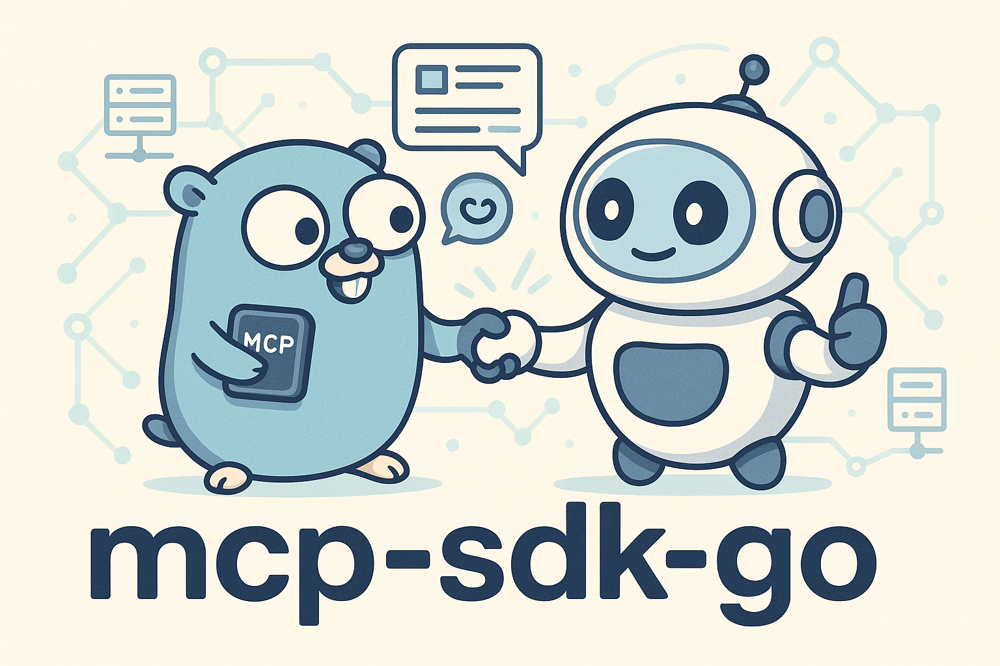

[](./README_ja.md)

# mcp-sdk-go



This is an MCP SDK (written in Golang) implemented with reference to the [modelcontextprotocol/typescript-sdk](https://github.com/modelcontextprotocol/typescript-sdk) repository.
Using this SDK, you can implement an MCP server in Go with almost the same programming experience as the widely adopted [modelcontextprotocol/typescript-sdk](https://github.com/modelcontextprotocol/typescript-sdk). It's not an exaggeration to say that we've replaced it with Go.

However, some features (authentication, SSE, StreamableHTTP) are not yet implemented. At this stage, this SDK does not support HTTP-based transport, so we believe that authentication features would need to be implemented if we add HTTP support in the future.

Note: This SDK was implemented with the goal of understanding the MCP mechanism at the code level. Therefore, it's undecided whether we will continue to implement the unsupported features.

# Index
- [Installation](#installation)
- [Examples](#examples)
    - [Implement a computational MCP server](#implement-a-computational-mcp-server)
    - [Implement an interactive client](#implement-an-interactive-client)
- [How to use](#how-to-use)
    - [Server (`McpServer` / `Server`)](#server-mcpserver--server)
        - [McpServer](#mcpserver)
            - [1. Initialize McpServer](#1-initialize-mcpserver)
            - [2. Connect to Transport](#2-connect-to-transport)
            - [3. Tool](#3-tool)
            - [4. Resources](#4-resources)
            - [5. Prompt](#5-prompt)
        - [Server](#server)
    - [Client](#client)
        - [1. Initialize Client](#1-initialize-client)
        - [2. Connecting to Transport](#2-connecting-to-transport)
        - [3. Send Request to Server](#3-send-request-to-server)

# Installation
```
go get github.com/kakkky/mcp-sdk-go
```

# Examples

### Implement a computational MCP server
```go
func main() {
    // Create an MCP server instance
    mcpServer := mcpserver.NewMcpServer(
        schema.Implementation{
            Name:    "example-server",
            Version: "1.0.0",
        },
        &server.ServerOptions{
            Capabilities: schema.ServerCapabilities{
                Tools: &schema.Tools{
                    ListChanged: true,
                },
            },
        })
    // Register a tool
    mcpServer.Tool(
        "calculation",                      // Tool name
        "This tool performs a calculation", // Description
        schema.PropertySchema{ // Parameter schema expected in requests
            "operation": schema.PropertyInfoSchema{
                Type:        "string",
                Description: "The operation to perform (e.g., 'add', 'subtract')",
            },
            "numbers": schema.PropertyInfoSchema{
                Type:        "array",
                Description: "An array of numbers to perform the operation on",
            },
        },
        nil, // Tool metadata (skipped in this example)
        func(args map[string]any) (schema.CallToolResultSchema, error) { // Callback called when the tool is invoked
            operation, ok1 := args["operation"].(string)
            numbers, ok2 := args["numbers"].([]any)
            if !ok1 || !ok2 {
                return schema.CallToolResultSchema{
                    Content: []schema.ToolContentSchema{},
                    IsError: true,
                }, nil
            }

            var result float64
            for _, v := range numbers {
                if num, ok := v.(float64); ok {
                    switch operation {
                    case "add":
                        result += num
                    case "subtract":
                        result -= num
                    }
                } else {
                    return schema.CallToolResultSchema{
                        Content: []schema.ToolContentSchema{},
                        IsError: true,
                    }, nil
                }
            }

            return schema.CallToolResultSchema{
                Content: []schema.ToolContentSchema{
                    &schema.TextContentSchema{
                        Type: "text",
                        Text: "The result of the operation is: " + fmt.Sprintf("%v", result),
                    },
                },
            }, nil
        },
    )
    // Create a Transport using standard input/output
    transportStdio := transport.NewStdioServerTransport() 
    // Start the connection
    if err := mcpServer.Connect(transportStdio); err != nil {
        log.Fatalln("Failed to connect MCP server:", err)
    }
}
```

### Implement an interactive client
```go
func main() {
    // Create a client instance
    cli := client.NewClient(
        schema.Implementation{
            Name:    "example-client",
            Version: "1.0.0",
        },
        &client.ClientOptions{
            Capabilities: schema.ClientCapabilities{
                Roots: &schema.Roots{
                    ListChanged: true,
                },
            },
            ProtocolOptions: protocol.ProtocolOptions{
                EnforceStrictCapabilities: true,
            },
        },
    )
    // Set request handler for roots/list method
    cli.SetRequestHandler(&schema.ListRootsRequestSchema{MethodName: "roots/list"}, func(jrr schema.JsonRpcRequest) (schema.Result, error) {
        return &schema.ListRootsResultSchema{
            Roots: []schema.RootSchema{
                {
                    Uri:  "file:///example/root1",
                    Name: "Root 1",
                },
            },
        }, nil
    })
    transportStdio := transport.NewStdioClientTransport(
        transport.StdioServerParameters{
            Command: "go",
            Args:    []string{"run", "./path/to/mcp-server"}, // Command to run the server program
        },
    )
    go func() {
        err := cli.Connect(transportStdio)
        if err != nil {
            log.Fatalf("Failed to connect to MCP server: %v", err)
        }
    }()
    // Wait for initialization phase to complete
    <-client.OperationPhaseStartedNotify
    fmt.Println("Initialization complete 🎉 Client is ready to send commands.")
    // Loop for command input
    scanner := bufio.NewScanner(os.Stdin)
    fmt.Println("Enter method :  ")
    for scanner.Scan() {
        switch scanner.Text() {
        case "ping":
            result, err := cli.Ping()
            if err != nil {
                fmt.Println(err)
            }
            fmt.Println("Ping", result)
        case "resources/list":
            // omitted
        }
        fmt.Println("Enter method :  ")
    }
}
```

# How to use
Here's a brief explanation of how to use the server and client.

## Server(`McpServer`/`Server`)
### `McpServer`
The `McpServer` struct provides a simple API for handling the three main features of MCP: **resources, tools, and prompts**.

### 1. Initialize McpServer
Initialize an MCP server instance. Fill in the `schema.ServerCapabilities` struct with the features your MCP server provides. For example, in the following case, it indicates that it supports Resources, Prompts, and Completion, but not Tools.

```go
mcpServer := mcpserver.NewMcpServer(
    // MCP server information
    schema.Implementation{
        Name:    "example-server",
        Version: "1.0.0",
    },
    // Options
    &server.ServerOptions{
        // Features provided by the server
        Capabilities: schema.ServerCapabilities{
            Resources: &schema.Resources{
                ListChanged: true,
            },
            Prompts: &schema.Prompts{
                ListChanged: true,
            },
            Completion: &schema.Completion{},
        },
        // Check if the client has declared and supports the capabilities when sending requests to the client
        // If this option is not set, the check will be skipped
        ProtocolOptions: protocol.ProtocolOptions{
            EnforceStrictCapabilities: true,
        },
    })
```

Regarding `ProtocolOptions`, for example, if during the initialization phase, the server tries to send a `sampling/createMessage` request despite the client not supporting `sampling` as shown below, it will generate an error.
```json
{
  "capabilities": {
    "roots": {
      "listChanged": true
    }
  }
}
```
This option can also be used on the `Client` side. When used with the `Client`, it checks whether the server has declared the capability before sending a request.


### 2. Connect to Transport
`McpServer` (`Server`) depends on the `Transport` interface. Inject a concrete type that satisfies the `Transport` interface through the `Connect` method.
```go
// Stdio transport for server
transport := transport.NewStdioServerTransport()
if err := mcpServer.Connect(transport); err != nil {
    log.Fatalln(err)
}
```
When the `Connect` method is called, it starts communication with the client and begins the [initialization phase](https://modelcontextprotocol.io/specification/2025-06-18/basic/lifecycle#initialization).

Also, the `Connect` method blocks the main thread. If you want to continue with subsequent processing, do the following:
```go
transport := transport.NewStdioServerTransport()
// Prevent the main thread from terminating
wg := sync.WaitGroup{}
wg.Add(1)
// Use Connect in a goroutine
go func() {
    defer wg.Done()
    err := mcpServer.Connect(transport)
    if err != nil {
        panic(err)
    }
}()
// Block here until the initialization phase completes normally,
// and proceed to subsequent processing when the Operation phase can start
<-server.OperationPhaseStartedNotify

// Subsequent processing
// Example: ping request
result , err:=mcpServer.Server.Ping()
```
This channel is very important for controlling the progression of the main thread.
```go
// Notification is sent to this channel when the client sends an initialized Notification
// After receiving this notification, the Operation Phase can begin
// If you want to send requests from the Server after Connect, you need to do so after receiving from this channel
var OperationPhaseStartedNotify = make(chan struct{}, 1)
```

Regarding Transport, at this stage, only Stdio (Standard Input/Output) is supported. 
Reference: https://modelcontextprotocol.io/docs/concepts/transports#transports

### 3. Tool
A Tool is defined as a way for LLMs to perform actions through the server (https://modelcontextprotocol.io/docs/concepts/tools). Call the `Tool` method from the `McpServer` instance. This enables support for the `tools/list` and `tools/call` methods.
```go
mcpServer:=mcpserver.NewMcpServer(...) // omitted
mcpServer.Tool(
    "calculation",                      // Tool name
    "This tool performs a calculation", // Description
    schema.PropertySchema{ // Parameter schema expected in the request
        "operation": schema.PropertyInfoSchema{
            Type:        "string",
            Description: "The operation to perform (e.g., 'add', 'subtract')",
        },
        "numbers": schema.PropertyInfoSchema{
            Type:        "array",
            Description: "An array of numbers to perform the operation on",
        },
    },
    &schema.ToolAnotationsSchema{
            Title:        "Calculator",
            ReadOnlyHint: true,
    },
    func(args map[string]any) (schema.CallToolResultSchema, error) { // Callback called when the tool is invoked
        operation, ok1 := args["operation"].(string)
        numbers, ok2 := args["numbers"].([]any)
        if !ok1 || !ok2 {
            return schema.CallToolResultSchema{
                Content: []schema.ToolContentSchema{},
                IsError: true,
            }, nil
        }
        var result float64
        for _, v := range numbers {
            if num, ok := v.(float64); ok {
                switch operation {
                case "add":
                    result += num
                case "subtract":
                    result -= num
                }
            } else {
                return schema.CallToolResultSchema{
                    Content: []schema.ToolContentSchema{},
                    IsError: true,
                }, nil
            }
        }
        return schema.CallToolResultSchema{
            Content: []schema.ToolContentSchema{
                &schema.TextContentSchema{
                    Type: "text",
                    Text: "The result of the operation is: " + fmt.Sprintf("%v", result),
                },
            },
        }, nil
    },
)
```
Use your editor's completion to follow the types.
| argName          | 説明                                                                                         |
|------------------|----------------------------------------------------------------------------------------------|
| `name`           | Tool name                                                                                     |
| `description`    | Tool description                                                                               |
| `propertySchema` | Schema for arguments the tool expects when called via `tools/call`          |
| `annotations`    | Additional metadata about the tool's behavior, helps clients understand how to display and manage the tool |
| `callback`       | 	The tool implementation. Receives the expected arguments defined in `propertySchema` and generates the result to be included in the response |

The `Tool` method returns a `*RegisteredTool`. This struct provides the following method fields. When the `Update` method is called, it sends a `notifications/tools/list_changed` notification to the client.
```go
type RegisteredTool struct {
    // 他省略
    Enable         func()
    Remove         func()
    Disable        func()
    Update         func(ToolUpdates)
}
```

### 4. Resources
Resources are defined as a way to provide specific content from the server to the LLM (https://modelcontextprotocol.io/docs/concepts/resources). Call the `Resource` method from the `McpServer` instance. This enables support for the `resources/list` and `resources/read` methods.
```go
mcpServer.Resource(
    "example", // Resource name
    "file:///sample/uri", // Resource URI
    &schema.ResourceMetadata{ // Metadata
        Description: "This is an example resource",
        MimeType:    "text/plain",
    },
    // Callback called when resources/read is requested with the specified URI
    func(url url.URL) (schema.ReadResourceResultSchema, error) {
        return schema.ReadResourceResultSchema{Contents: []schema.ResourceContentSchema{
            &schema.TextResourceContentsSchema{
                UriData:      url.String(),
                MimeTypeData: "text/plain",
                ContentData:  "This is the content of the example resource.",
            },
    }}, nil
  }
);
```
Use your editor's completion to follow the types.
| argName |  | 
| ---- | ---- | 
| `name` | Resource name |
| `uri` | URI that identifies the resource |
| `metadata` | Resource metadata |
| `readResourceCallBack` | Callback that returns the content of the resource matching the URI when a resources/read request is received |

The `Resource` method returns a `*RegisteredResource`. This struct provides the following method fields. When the `Update` method is called, it sends a `notifications/resources/list_changed` notification to the client.
```go
type RegisteredTool struct {
    // others omitted
    Enable       func() // Enable the resource
    Disable      func() // Disable the resource
    Update       func(ResourceUpdates) // Update the resource
    Remove       func() // Remove the resource registration
}
```

Resource URIs are represented in the following format (https://modelcontextprotocol.io/docs/concepts/resources#resource-uris).
```
[protocol]://[host]/[path]
```

Additionally, it's possible to expose parameterized resources using URI templates via the `ResourceTemplate` method. Create a template using `NewResourceTemplate` and pass it to `ResourceTemplate`. This enables support for the `resources/templates/list` and `completion/complete` methods.
```go
// Create a resource URI template
template, err := mcpserver.NewResourceTemplate(
    // URI template
    "file:///sample/{variable}",
    // Callbacks
    &mcpserver.ResourceTemplateCallbacks{
        // Callback called by the resources/templates/list method
        List: func() schema.ListResourcesResultSchema {
            return schema.ListResourcesResultSchema{
                Resources: []schema.ResourceSchema{
                    {
                        Name: "example-template",
                        Uri:  "file:///sample/example-value",
                    },
                    {
                        Name: "another-template",
                        Uri:  "file:///sample/another-value",
                    },
                },
            }
        },
        // Callback called when the completion/complete method is requested
        Complete: map[string]mcpserver.CompleteResourceCallback{
            "variable": func(value string) []string {
                // Here we simply return fixed values, but in practice, you could generate candidates with some logic
                return []string{"example-value", "another-value"}
            },
        },
    })
```
```go
mcpServer.ResourceTemplate(
    "example-template",
    template,
    &schema.ResourceMetadata{
        Description: "This is an example resource template",
        MimeType:    "text/plain",
    },
    func(url url.URL, variables map[string]any) (schema.ReadResourceResultSchema, error) {
        switch variables["variable"] {
        case "example-value":
            return schema.ReadResourceResultSchema{Contents: []schema.ResourceContentSchema{
                &schema.TextResourceContentsSchema{
                    UriData:      "file:///sample/example-value",
                    MimeTypeData: "text/plain",
                    ContentData:  "This is the content of the example resource template",
                },
            }}, nil
        case "another-value":
            return schema.ReadResourceResultSchema{Contents: []schema.ResourceContentSchema{
                &schema.TextResourceContentsSchema{
                    UriData:      "file:///sample/another-value",
                    MimeTypeData: "text/plain",
                    ContentData:  "This is the content of another example resource template",
                },
            }}, nil
        }
        return schema.ReadResourceResultSchema{}, nil
    },
)
```
Use your editor's completion to follow the types.
| argName |  | 
| ---- | ---- | 
| `name` | Resource name |
| `template` | Resource name |
| `metadata` | Resource name |
| `readResourceTemplateCallBack` | Callback that returns the content of the resource matching the URI when a `resources/read` request is received |

Additionally, the `ResourceTemplate` method returns a `*RegisteredResourceTemplate`. This struct provides the following method fields. When the `Update` method is called, it sends a `notifications/resources/list_changed` notification to the client.
```go
type RegisteredResourceTemplate struct {
    // others omitted
    Enable       func() // Enable the resource
    Disable      func() // Disable the resource
    Update       func(ResourceTemplateUpdates) // Update the resource
    Remove       func() // Remove the resource registration
}
```

### 5. Prompt
Prompts are defined as a way for servers to provide structured messages and instructions needed for interaction with language models (https://modelcontextprotocol.io/docs/concepts/prompts). Call the `Prompt` method from the `McpServer` instance. This enables support for the `prompts/list`, `prompts/get`, and `completion/complete` methods.

```go
mcpServer:=mcpserver.NewMcpServer(...) // omitted
mcpServer.Prompt(
    // Prompt name
    "example-prompt",
    // Description
    "This is an example prompt",
    // Argument schema expected for prompt/get
    []schema.PromptAugmentSchema{
        {
            Name:             "input", // Argument name
            Description:      "This is an input parameter", // Argument description
            Required:         true, // Whether it's required
            CompletionValues: []string{"value1", "value2", "value3"}, // Set the arguments returned by completion/complete. Specify if there are expected arguments.
        },
    },
    // Callback called by prompts/get
    func(args []schema.PromptAugmentSchema) (schema.GetPromptResultSchema, error) {
        var promptMessages []schema.PromptMessageSchema
        for _, arg := range args {
            if arg.Name == "input" {
                promptMessages = append(promptMessages, schema.PromptMessageSchema{
                    Role: "user",
                    Content: &schema.TextContentSchema{
                        Type: "text",
                        Text: "You provided input: " + arg.CompletionValues[0], //
                    },
                })
            }
        }
        return schema.GetPromptResultSchema{
            Description: "This is a response from the example prompt",
            Messages:    promptMessages,
        }, err
    },
)
```
Use your editor's completion to follow the types.
|argName| |	
|----|----|
|`name` |Prompt name |
|`description`| Prompt description|
| `argsSchema`| Definition of variables used in the prompt | 
| `callback` |Waits for a `prompts/get` request, receives variables, and sends prompts to the client for the LLM|

Additionally, the `Prompt` method returns a `*RegisteredPrompt`. This struct provides the following method fields. When the `Update` method is called, it sends a `notifications/prompts/list_changed` notification to the client.
```go
type RegisteredPrompt struct {
    // others omitted
    Enable       func() // Enable the prompt
    Disable      func() // Disable the prompt
    Update       func(PromptUpdates) // Update the prompt
    Remove       func() // Remove the prompt registration
}
```

### `Server`
`Server` provides the basic functionality of an MCP server. The `McpServer` described above internally uses `Server`. `McpServer` is just a more user-friendly wrapper around `Server` (focusing on Tools/Resources/Prompts) that provides the basic functionality of an MCP server.

It provides the following basic methods:
```go
// Set a request handler
func (shared.Protocol) SetRequestHandler(schema schema.Request, handler func(schema.JsonRpcRequest) (schema.Result, error))
// Set a notification handler
func (shared.Protocol) SetNotificationHandler(schema schema.Notification, handler func(schema.JsonRpcNotification) error)

// Basic communication methods

// Send a sampling/createMessage request
func (s *Server) CreateMessage(params any, contentType string) (schema.Result, error)
// Send a roots/list request
func (s *Server) ListRoots() (schema.Result, error)
// Send a ping request
func (s *Server) Ping() (schema.Result, error)
// Send a logging/message request
func (s *Server) SendLoggingMessage(params schema.LoggingMessageNotificationParams) error
// Send a notifications/prompts/list_changed notification
func (s *Server) SendPromptListChanged() error
// Send a notifications/resources/list_changed notification
func (s *Server) SendResourceListChanged() error
// Send a notifications/resources/updated notification
func (s *Server) SendResourceUpdated(params schema.ResourceUpdatedNotificationParams) error
// Send a notifications/tools/list_changed notification
func (s *Server) SendToolListChanged() error
```

You can initialize `Server` itself to build an MCP server, but generally, you should use `McpServer`. As a recommended approach, access the `Server` field from the `McpServer` instance and handle methods as follows:
```go
// Send logging/message
mcpServer.Server.SendLoggingMessage(
    schema.LoggingMessageNotificationParams{
        Level: schema.NOTICE,
        Data:  "Server started successfully",
    },
)

// Send ping
mcpServer.Server.Ping()
```

You can also set request handlers as follows:
```go
mcpServer.Server.SetRequestHandler(
    &schema.ListToolsRequestSchema{MethodName: "tools/list"},
    func(jrr schema.JsonRpcRequest) (schema.Result, error) {
        return &schema.ListToolsResultSchema{
            Tools: []schema.ToolSchema{
                {
                    Name:        "example-tool",
                    Description: "This is an example tool",
                    InputSchema: schema.InputSchema{
                        Type: "object",
                        Properties: schema.PropertySchema{
                            "input": schema.PropertyInfoSchema{
                                Type:        "string",
                                Description: "Input for the example tool",
                            },
                        },
                        Required: []string{"input"},
                    },
                },
                {
                    // omitted
                }
            },
        }, nil
    },
)
```

## Client
### 1. Initialize Client
Initialize a `Client` instance.
```go
// Create a client instance
cli := client.NewClient(
    // Basic client information
    schema.Implementation{
        Name:    "example-client",
        Version: "1.0.0",
    },
    // Options
    &client.ClientOptions{
        // Features provided by the client
        Capabilities: schema.ClientCapabilities{
            Roots: &schema.Roots{
                ListChanged: true,
            },
        },
    },
)
```

### 2. Connecting to Transport
`Client` depends on the `Transport` interface. Like `McpServer` (`Server`), inject a concrete type through the `Connect` method.
```go
transportStdio := transport.NewStdioClientTransport(
    // Command to run the server program
    // Of course, this is language-independent
    transport.StdioServerParameters{
        Command: "go",
        Args:    []string{"run", "./path/to/mcp-server"},
    },
)
// Connect in a goroutine
go func() {
    err := cli.Connect(transportStdio)
    if err != nil {
        log.Fatalf("Failed to connect to MCP server: %v", err)
    }
}()
// Block here until the initialization phase completes normally,
// and proceed to subsequent processing when the Operation phase can start
<-client.OperationPhaseStartedNotify
fmt.Println("Initialization complete 🎉 Client is ready to send commands.")

// Subsequent processing
```

This channel is very important for controlling the progression of the main thread.
```go
// Notification channel to start the Operation phase after the Initialization phase is completed
var OperationPhaseStartedNotify = make(chan struct{}, 1)
```

Regarding Transport, at this stage, only `Stdio` (Standard Input/Output) is supported.
Reference: https://modelcontextprotocol.io/docs/concepts/transports#transports

### 3. Send Request to Server
Methods are provided for communicating with the server.
```go
// tools/list
func (c *Client) ListTools() (schema.Result, error)
// tools/call
func (c *Client) CallTool(params schema.CallToolRequestParams) (schema.Result, error)

// completion/complete
func (c *Client) Complete(params schema.CompleteRequestParams) (schema.Result, error)

// prompts/list
func (c *Client) ListPrompts() (schema.Result, error)
// prompts/get
func (c *Client) GetPrompt(params schema.GetPromptRequestParams) (schema.Result, error)

// resources/list
func (c *Client) ListResources() (schema.Result, error)
// resources/templates/list
func (c *Client) ListResourceTemplates() (schema.Result, error)
// resources/read
func (c *Client) ReadResource(params schema.ReadResourceRequestParams) (schema.Result, error)
// resources/subscribe
func (c *Client) SubscribeResource(params schema.SubscribeRequestParams) (schema.Result, error)
// resources/unsubscribe
func (c *Client) UnsubscribeResource(params schema.UnsubscribeRequestParams) (schema.Result, error)

// ping
func (c *Client) Ping() (schema.Result, error)

// logging/setLevel
func (c *Client) SetLoggingLevel(level schema.LoggingLevelSchema) (schema.Result, error)

// notifications/roots/list_changed
func (c *Client) SendRootsListChanged() error
```