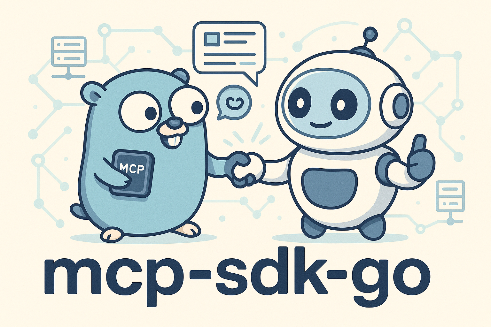

# mcp-sdk-go



これは、[modelcontextprotocol/typescript-sdk](https://github.com/modelcontextprotocol/typescript-sdk)のリポジトリを参考にして実装したMCPのSDK(Golang製)となっています。
このSDKを使用すれば、かなり普及している[modelcontextprotocol/typescript-sdk](https://github.com/modelcontextprotocol/typescript-sdk)とほとんど同じ書き心地で、Goを用いたMCPサーバーの実装が可能になります。Goでリプレースしたと言っても過言ではありません。

しかしながら、一部の機能（認証系、SSE、StreamableHTTP）は未実装となっています。現段階のこのSDKではHTTPベースのトランスポートに対応していないので、今後実装する場合には認証系の機能も満たす必要があると考えています。

注意：MCPのメカニズムをコードベースで知りたいという目的で本SDKは実装に至りました。なので、未対応の機能に対応していくかは未定です。

# Installation
```
go get github.com/kakkky/mcp-sdk-go
```

# Examples

### Implement a computational MCP server
```go
func main() {
	// MCPサーバーインスタンスを作成
	mcpServer := mcpserver.NewMcpServer(
		schema.Implementation{
			Name:    "example-server",
			Version: "1.0.0",
		},
		&server.ServerOptions{
			Capabilities: schema.ServerCapabilities{
				Tools: &schema.Tools{
					ListChanged: true,
				},
			},
		})
	// ツールを登録
	mcpServer.Tool(
		"calculation",                      // ツール名
		"This tool performs a calculation", // 説明
		schema.PropertySchema{ // リクエストで期待するパラメータスキーマ
			"operation": schema.PropertyInfoSchema{
				Type:        "string",
				Description: "The operation to perform (e.g., 'add', 'subtract')",
			},
			"numbers": schema.PropertyInfoSchema{
				Type:        "array",
				Description: "An array of numbers to perform the operation on",
			},
		},
		nil, // ツールのメタデータを設定（今回はスキップ）
		func(args map[string]any) (schema.CallToolResultSchema, error) { // ツールをcallされた時に呼ばれるコールバック
			operation, ok1 := args["operation"].(string)
			numbers, ok2 := args["numbers"].([]any)
			if !ok1 || !ok2 {
				return schema.CallToolResultSchema{
					Content: []schema.ToolContentSchema{},
					IsError: true,
				}, nil
			}

			var result float64
			for _, v := range numbers {
				if num, ok := v.(float64); ok {
					switch operation {
					case "add":
						result += num
					case "subtract":
						result -= num
					}
				} else {
					return schema.CallToolResultSchema{
						Content: []schema.ToolContentSchema{},
						IsError: true,
					}, nil
				}
			}

			return schema.CallToolResultSchema{
				Content: []schema.ToolContentSchema{
					&schema.TextContentSchema{
						Type: "text",
						Text: "The result of the operation is: " + fmt.Sprintf("%v", result),
					},
				},
			}, nil
		},
	)
    // 標準入出力を使用するTransportを作成
	transportStdio := transport.NewStdioServerTransport() 
    // コネクション開始
	if err := mcpServer.Connect(transportStdio); err != nil {
		log.Fatalln("Failed to connect MCP server:", err)
	}
}
```
### Implement an interactive client
```go
func main() {
	// クライアントインスタンスを作成
	cli := client.NewClient(
		schema.Implementation{
			Name:    "example-client",
			Version: "1.0.0",
		},
		&client.ClientOptions{
			Capabilities: schema.ClientCapabilities{
				Roots: &schema.Roots{
					ListChanged: true,
				},
			},
			ProtocolOptions: protocol.ProtocolOptions{
				EnforceStrictCapabilities: true,
			},
		},
	)
	// roots/list メソッドのリクエストハンドラを設定
	cli.SetRequestHandler(&schema.ListRootsRequestSchema{MethodName: "roots/list"}, func(jrr schema.JsonRpcRequest) (schema.Result, error) {
		return &schema.ListRootsResultSchema{
			Roots: []schema.RootSchema{
				{
					Uri:  "file:///example/root1",
					Name: "Root 1",
				},
			},
		}, nil
	})
	transportStdio := transport.NewStdioClientTransport(
		transport.StdioServerParameters{
			Command: "go",
			Args:    []string{"run", "./path/to/mcp-server"}, // サーバープログラムの実行コマンド
		},
	)
	go func() {
		err := cli.Connect(transportStdio)
		if err != nil {
			log.Fatalf("Failed to connect to MCP server: %v", err)
		}
	}()
	// 初期化フェーズの終了を待つ
	<-client.OperationPhaseStartedNotify
	fmt.Println("Initialization complete 🎉 Client is ready to send commands.")
	// コマンド入力のためのループ
	scanner := bufio.NewScanner(os.Stdin)
	fmt.Println("Enter method :  ")
	for scanner.Scan() {
		switch scanner.Text() {
		case "ping":
			result, err := cli.Ping()
			if err != nil {
				fmt.Println(err)
			}
			fmt.Println("Ping", result)
		case "resources/list":
			// 省略
		}
		fmt.Println("Enter method :  ")
	}
}
```
# How to use
サーバー、クライアントに分けて使い方を簡単に説明します。
## Server(`McpServer`/`Server`)
### <McpServer>
`McpServer`構造体は、MCPにおけるサーバーの機能の中でも主流な３つ、**リソース**/**ツール**/**プロンプト**を扱うためのシンプルなAPIを提供します。

### 1. Initialize McpServer
MCPサーバーインスタンスを初期化します。
`schema.ServerCapabilities`構造体の中には、あなたのMCPサーバーが提供する機能を埋めてください。たとえば、以下の場合だとResources,Prompts,Completionには対応していますが、Toolsには対応していないことを示します。
```go
mcpServer := mcpserver.NewMcpServer(
    // MCPサーバーの情報
    schema.Implementation{
        Name:    "example-server",
        Version: "1.0.0",
    },
    // オプション
    &server.ServerOptions{
        // サーバーが提供する機能
        Capabilities: schema.ServerCapabilities{
            Resources: &schema.Resources{
                ListChanged: true,
            },
            Prompts: &schema.Prompts{
                ListChanged: true,
            },
            Completion: &schema.Completion{},
        },
        // クライアントにリクエストを送るときに、それをクライアントがCapabilitiesとして宣言しており、対応しているのかをチェックする
        // このオプションを設定しなければチェックをスキップします。
        ProtocolOptions: protocol.ProtocolOptions{
			EnforceStrictCapabilities: true,
		},
    })
```

`ProtocolOptions`に関しては、たとえば、初期化フェーズにてクライアントが以下のように`sampling`に対応していないにも関わらずサーバーから`sampling/createMessage`リクエストを送ろうとした場合はエラーを発生させます。
```json
{
  "capabilities": {
    "roots": {
      "listChanged": true
    }
  }
}
```
このオプションは、`Client`側でも使うことができます。`Client`で使用した際は、これとは反対に、クライアントからサーバーへの送信前に、サーバーが`Capabilities`として宣言しているかどうかをチェックします。

### 2. Connect to Transport
`McpServer`(`Server`)は`Transport`インターフェースに依存しています。`Transport`インターフェースを満たす具体型を`Connect`メソッドから注入してください。
```go
// server用 Stdioトランスポート
transport := transport.NewStdioServerTransport()
if err := mcpServer.Connect(transport); err != nil {
    log.Fatalln(err)
}
```
`Connect`メソッドが呼ばれると、クライアントとの通信を開始し、[初期化フェーズ](https://modelcontextprotocol.io/specification/2025-06-18/basic/lifecycle#initialization)を開始します。

また、`Connect`メソッドはメインスレッドをブロッキングします。後続の処理を続けたい場合は、以下のようにします。
```go
transport := transport.NewStdioServerTransport()
// メインスレッドが終了しないようにする
wg := sync.WaitGroup{}
wg.Add(1)
// goroutine内でConnectを使用
go func() {
    defer wg.Done()
    err := mcpServer.Connect(transport)
    if err != nil {
        panic(err)
    }
}()
// 初期化フェーズが正常に終了するまでここでブロッキングし、
// Operationフェーズが開始できるようになれば後続の処理に移行する
<-server.OperationPhaseStartedNotify

// 後続の処理
// 例：ping リクエスト
result , err:=mcpServer.Server.Ping()
```
このチャネルは、メインスレッドの進行を操作するのに非常に重要です。
```go
// クライアントから initialized Notification が送られたときにチャネルに通知が送られる
// この通知を受信後、OperationPhaseが開始できる
// Connect後にServerからリクエストを送る場合は、このチャネル受信後に行う必要がある
var OperationPhaseStartedNotify = make(chan struct{}, 1)
```

Transportについては、現段階では`Stdio`(Standard Input/Output)のみに対応しています。
参考：https://modelcontextprotocol.io/docs/concepts/transports#transports


### 3. Tool
Toolとは、LLMがサーバー経由でアクションを実行できるようにするものと定義されています（https://modelcontextprotocol.io/docs/concepts/tools）。
`McpServer`インスタンスから`Tool`メソッドを呼び出します。これにより、`tools/list``tools/call`メソッドに対応できます。
```go
mcpServer:=mcpserver.NewMcpServer(...) //省略
mcpServer.Tool(
    "calculation",                      // ツール名
    "This tool performs a calculation", // 説明
    schema.PropertySchema{ // リクエストで期待するパラメータスキーマ
        "operation": schema.PropertyInfoSchema{
            Type:        "string",
            Description: "The operation to perform (e.g., 'add', 'subtract')",
        },
        "numbers": schema.PropertyInfoSchema{
            Type:        "array",
            Description: "An array of numbers to perform the operation on",
        },
    },
    &schema.ToolAnotationsSchema{
			Title:        "Calculator",
			ReadOnlyHint: true,
	},
    func(args map[string]any) (schema.CallToolResultSchema, error) { // ツールをcallされた時に呼ばれるコールバック
        operation, ok1 := args["operation"].(string)
        numbers, ok2 := args["numbers"].([]any)
        if !ok1 || !ok2 {
            return schema.CallToolResultSchema{
                Content: []schema.ToolContentSchema{},
                IsError: true,
            }, nil
        }
        var result float64
        for _, v := range numbers {
            if num, ok := v.(float64); ok {
                switch operation {
                case "add":
                    result += num
                case "subtract":
                    result -= num
                }
            } else {
                return schema.CallToolResultSchema{
                    Content: []schema.ToolContentSchema{},
                    IsError: true,
                }, nil
            }
        }
        return schema.CallToolResultSchema{
            Content: []schema.ToolContentSchema{
                &schema.TextContentSchema{
                    Type: "text",
                    Text: "The result of the operation is: " + fmt.Sprintf("%v", result),
                },
            },
        }, nil
    },
)
```

エディタの補完等を利用し、型に従って記述してください。
| argName          |  |
|------------------|----------------------------------------------------------------------------------------------|
| `name`           | ツール名                                                                                     |
| `description`    | ツールの説明                                                                                 |
| `propertySchema` | クライアントから `tools/call` される時に期待する、ツールが受け取る引数のスキーマ            |
| `annotations`    | ツールの動作に関する追加のメタデータ。クライアントがツールの表示方法や管理方法を理解するのに役立つ |
| `callback`       | ツールの実体。`propertySchema` に定義したような、期待する引数を受け取り、レスポンスに含まれる結果を生成する |

`Tool`メソッドは`*RegisteredTool`を返します。この構造体には、以下のメソッドフィールドが用意されています。
`Update`メソッドが呼ばれた場合には、クライアントに`notifications/tools/list_changed`通知を送信します。
```go
type RegisteredTool struct {
    // 他省略
    Enable         func()
    Remove         func()
    Disable        func()
    Update         func(ToolUpdates)
}
```

### 4. Resources
Resoureは、サーバーからLLMに特定のコンテンツを提供できるようにするものと定義されています（https://modelcontextprotocol.io/docs/concepts/resources）。
`McpServer`インスタンスから`Resource`メソッドを呼び出します。これにより、`reources/list``resources/read`メソッドに対応できます。
```go
mcpServer.Resource(
    "example", // リソース名
    "file:///sample/uri", // リソースURI
    &schema.ResourceMetadata{ // メタデータ
        Description: "This is an example resource",
        MimeType:    "text/plain",
    },
    // 指定のURIで resources/read された時に呼び出されるコールバック
    func(url url.URL) (schema.ReadResourceResultSchema, error) {
        return schema.ReadResourceResultSchema{Contents: []schema.ResourceContentSchema{
            &schema.TextResourceContentsSchema{
                UriData:      url.String(),
                MimeTypeData: "text/plain",
                ContentData:  "This is the content of the example resource.",
            },
    }}, nil
  }
);
```


エディタの補完等を利用し、型に従って記述してください。
| argName |  | 
| ---- | ---- | 
| `name` | リソース名 |
| `uri` | リソースを識別するURI|
| `metadata` | リソースのメタデータ |
| `readResourceCallBack` | `resources/read`のリクエストを受けてURIに合致するリソースが持つコンテンツを返すコールバック |

`Resource`メソッドは`*RegisteredResource`を返します。この構造体には、以下のメソッドフィールドが用意されています。
`Update`メソッドが呼ばれた場合には、クライアントに`notifications/resources/list_changed`通知を送信します。
```go
type RegisteredResource struct {
    // 他省略
    Enable       func() // リソースを使用可にする
    Disable      func() // リソースを使用不可にする
    Update       func(ResourceUpdates) // リソースを更新する
    Remove       func() // リソースの登録を削除する
}
```

リソースURIは以下の形式で表します(https://modelcontextprotocol.io/docs/concepts/resources#resource-uris)。
```
[protocol]://[host]/[path]
```

また、`ResourceTemplate`メソッドによってURIテンプレートを使用してパラメータ化されたリソースを公開することが可能です。
`NewResourceTemplate`によってテンプレートを作成し、`ResourceTemplate`に渡します。これにより、`resources/templates/list``completion/complete`メソッドに対応できます。
```go
// リソースURIテンプレートを作成する
template, err := mcpserver.NewResourceTemplate(
    // URIテンプレート
    "file:///sample/{variable}",
    // コールバック群
    &mcpserver.ResourceTemplateCallbacks{
        // resources/templates/listメソッドで呼ばれるコールバック
        List: func() schema.ListResourcesResultSchema {
            return schema.ListResourcesResultSchema{
                Resources: []schema.ResourceSchema{
                    {
                        Name: "example-template",
                        Uri:  "file:///sample/example-value",
                    },
                    {
                        Name: "another-template",
                        Uri:  "file:///sample/another-value",
                    },
                },
            }
        },
        // completion/completeメソッドがリクエストされた時に呼ばれるコールバック
        Complete: map[string]mcpserver.CompleteResourceCallback{
            "variable": func(value string) []string {
                // ここでは単純に固定の値を返すが、実際には何らかのロジックで候補を生成することができる
                return []string{"example-value", "another-value"}
            },
        },
    })
```
```go
mcpServer.ResourceTemplate(
    "example-template",
    template,
    &schema.ResourceMetadata{
        Description: "This is an example resource template",
        MimeType:    "text/plain",
    },
    func(url url.URL, variables map[string]any) (schema.ReadResourceResultSchema, error) {
        switch variables["variable"] {
        case "example-value":
            return schema.ReadResourceResultSchema{Contents: []schema.ResourceContentSchema{
                &schema.TextResourceContentsSchema{
                    UriData:      "file:///sample/example-value",
                    MimeTypeData: "text/plain",
                    ContentData:  "This is the content of the example resource template",
                },
            }}, nil
        case "another-value":
            return schema.ReadResourceResultSchema{Contents: []schema.ResourceContentSchema{
                &schema.TextResourceContentsSchema{
                    UriData:      "file:///sample/another-value",
                    MimeTypeData: "text/plain",
                    ContentData:  "This is the content of another example resource template",
                },
            }}, nil
        }
        return schema.ReadResourceResultSchema{}, nil
    },
)
```


エディタの補完等を利用し、型に従って記述してください。
| argName |  | 
| ---- | ---- | 
| `name` | リソース名 |
| `template` | URIテンプレート |
| `metadata` | リソースのメタデータ |
| `readResourceTemplateCallBack` | `resources/read`のリクエストを受けてURIに合致するリソースが持つコンテンツを返すコールバック |

また、`ResourceTemplate`メソッドは`*RegisteredResourceTemplate`を返します。この構造体には、以下のメソッドフィールドが用意されています。
`Update`メソッドが呼ばれた場合には、クライアントに`notifications/resources/list_changed`通知を送信します。
```go
type RegisteredResourceTemplate struct {
    // 他省略
    Enable       func() // リソースを使用可にする
    Disable      func() // リソースを使用不可にする
    Update       func(ResourceTemplateUpdates) // リソースを更新する
    Remove       func() // リソースの登録を削除する
}
```

### 5. Prompt
Promptとは、サーバーは言語モデルとの対話に必要な構造化されたメッセージと指示を提供できるものと定義されています（https://modelcontextprotocol.io/docs/concepts/prompts）。
`McpServer`インスタンスから`Prompt`メソッドを呼び出します。これにより、`prompts/list``prompts/get``completion/complete`メソッドに対応できます。
```go
mcpServer:=mcpserver.NewMcpServer(...) //省略
mcpServer.Prompt(
    // プロンプト名
    "example-prompt",
    // 説明
    "This is an example prompt",
    // prompt/getで期待する引数のスキーマ
    []schema.PromptAugmentSchema{
        {
            Name:             "input", // 引数名
            Description:      "This is an input parameter", // 引数の説明
            Required:         true, // 必須かどうか
            CompletionValues: []string{"value1", "value2", "value3"}, // completion/completeで返される引数を設定。期待する引数があれば記述します。
        },
    },
    // prompts/getで呼ばれるコールバック
    func(args []schema.PromptAugmentSchema) (schema.GetPromptResultSchema, error) {
        var promptMessages []schema.PromptMessageSchema
        for _, arg := range args {
            if arg.Name == "input" {
                promptMessages = append(promptMessages, schema.PromptMessageSchema{
                    Role: "user",
                    Content: &schema.TextContentSchema{
                        Type: "text",
                        Text: "You provided input: " + arg.CompletionValues[0], //
                    },
                })
            }
        }
        return schema.GetPromptResultSchema{
            Description: "This is a response from the example prompt",
            Messages:    promptMessages,
        }, err
    },
)
```

エディタの補完等を利用し、型に従って記述してください。
|argName| |	
|----|----|
|`name` | プロンプト名 |
|`description`| プロンプトの説明 |
| `argsSchema`| プロンプトで使用する変数の定義 | 
| `callback` |`prompts/get`リクエストを待ち受け、変数を受け取り、LLMへ渡すためのプロンプトをクライアントに送信する |

また、`Prompt`メソッドは`*RegisteredPrompt`を返します。この構造体には、以下のメソッドフィールドが用意されています。 `Update`が呼ばれた場合には、`notifications/prompts/list_changed`通知がクライアントに送信されます。
```go
type RegisteredPrompt struct {
    // 他省略
    Enable       func() // プロンプトを有効にする
    Disable      func() // プロンプトを無効にする
    Update       func(PromptUpdates) // プロンプトを更新する
    Remove       func() // プロンプトの登録を削除する
}
```
### <Server>
`Server`は、MCPサーバーの基本的な機能を提供しています。上で説明している`McpServer`は、内部で`Server`を使用しています。あくまで`McpServer`はMCPサーバーの基本的機能を提供する`Server`を使いやすくしたもの（Tools/Resources/Promptsに特化して）となります。

以下のように基本的なメソッドを用意しています。
```go
// リクエストハンドラを設定する
func (shared.Protocol) SetRequestHandler(schema schema.Request, handler func(schema.JsonRpcRequest) (schema.Result, error))
// 通知ハンドラを設定する
func (shared.Protocol) SetNotificationHandler(schema schema.Notification, handler func(schema.JsonRpcNotification) error)

// 基本的な通信メソッド

// sampling/createMessage リクエストを送る
func (s *Server) CreateMessage(params any, contentType string) (schema.Result, error)
// roots/listリクエストを送る
func (s *Server) ListRoots() (schema.Result, error)
// ping リクエストを送る
func (s *Server) Ping() (schema.Result, error)
// logging/messageリクエストを送る
func (s *Server) SendLoggingMessage(params schema.LoggingMessageNotificationParams) error
// notifications/prompts/list_changed 通知を送る
func (s *Server) SendPromptListChanged() error
// notifications/resources/list_changed 通知を送る
func (s *Server) SendResourceListChanged() error
// notifications/resources/updated 通知を送る
func (s *Server) SendResourceUpdated(params schema.ResourceUpdatedNotificationParams) error
// notifications/tools/list_changed 通知を送る
func (s *Server) SendToolListChanged() error
```

`Server`自体を初期化してMCPサーバーを構築することもできますが、基本的には`McpServer`の方を使用してください。
推奨する方法として、`McpServer`インスタンスから`Server`フィールドにアクセスし、以下のようにメソッドを扱いましょう。
```go
// logging/message を送信
mcpServer.Server.SendLoggingMessage(
    schema.LoggingMessageNotificationParams{
        Level: schema.NOTICE,
        Data:  "Server started successfully",
    },
)

// ping を送信
mcpServer.Server.Ping()
```
また、以下のようにリクエストハンドラを設定することも可能です。
```go
mcpServer.Server.SetRequestHandler(
    &schema.ListToolsRequestSchema{MethodName: "tools/list"},
    func(jrr schema.JsonRpcRequest) (schema.Result, error) {
        return &schema.ListToolsResultSchema{
            Tools: []schema.ToolSchema{
                {
                    Name:        "example-tool",
                    Description: "This is an example tool",
                    InputSchema: schema.InputSchema{
                        Type: "object",
                        Properties: schema.PropertySchema{
                            "input": schema.PropertyInfoSchema{
                                Type:        "string",
                                Description: "Input for the example tool",
                            },
                        },
                        Required: []string{"input"},
                    },
                },
                {
                    // 省略
                }
            },
        }, nil
    },
)
```
## Client

### 1. Initialize Client
`Client`インスタンスを初期化します。
```go
// クライアントインスタンスを作成
cli := client.NewClient(
    // クライアントの基本情報
    schema.Implementation{
        Name:    "example-client",
        Version: "1.0.0",
    },
    // オプション
    &client.ClientOptions{
        // クライアントが提供する機能
        Capabilities: schema.ClientCapabilities{
            Roots: &schema.Roots{
                ListChanged: true,
            },
        },
    },
)
```

### 2. Connecting to Transport
`Client`は`Transport`インターフェースに依存しています。`McpServer`（`Server`）と同様に、`Connect`メソッドで具体型を注入します。
```go
transportStdio := transport.NewStdioClientTransport(
    // サーバープログラムの実行コマンド
    // もちろん言語には依存しない
    transport.StdioServerParameters{
        Command: "go",
        Args:    []string{"run", "./path/to/mcp-server"},
    },
)
// goroutine内でConnect
go func() {
    err := cli.Connect(transportStdio)
    if err != nil {
        log.Fatalf("Failed to connect to MCP server: %v", err)
    }
}()
// 初期化フェーズが正常に終了するまでここでブロッキングし、
// Operationフェーズが開始できるようになれば後続の処理に移行する
<-client.OperationPhaseStartedNotify
fmt.Println("Initialization complete 🎉 Client is ready to send commands.")

// 後続の処理

```
このチャネルは、メインスレッドの進行を操作するのに非常に重要です。
```go
// Initialization phaseが完了し、Operation phaseを開始するための通知チャネル
var OperationPhaseStartedNotify = make(chan struct{}, 1)
```

Transportについては、現段階では`Stdio`(Standard Input/Output)のみに対応しています。
参考：https://modelcontextprotocol.io/docs/concepts/transports#transports

### 3. Send Request to Server
サーバーと通信するためのメソッドが用意されており、これを使用します。
```go
// tools/list
func (c *Client) ListTools() (schema.Result, error)
// tools/call
func (c *Client) CallTool(params schema.CallToolRequestParams) (schema.Result, error)

// completion/complete
func (c *Client) Complete(params schema.CompleteRequestParams) (schema.Result, error)

// prompts/list
func (c *Client) ListPrompts() (schema.Result, error)
// prompts/get
func (c *Client) GetPrompt(params schema.GetPromptRequestParams) (schema.Result, error)

// resourecs/list
func (c *Client) ListResources() (schema.Result, error)
// resourecs/templates/list
func (c *Client) ListResourceTemplates() (schema.Result, error)
// resources/read
func (c *Client) ReadResource(params schema.ReadResourceRequestParams) (schema.Result, error)
// resources/subscribe
func (c *Client) SubscribeResource(params schema.SubscribeRequestParams) (schema.Result, error)
// resources/unsubscribe
func (c *Client) UnsubscribeResource(params schema.UnsubscribeRequestParams) (schema.Result, error)

// ping
func (c *Client) Ping() (schema.Result, error)

// logging/setLevel
func (c *Client) SetLoggingLevel(level schema.LoggingLevelSchema) (schema.Result, error)

// notifications/roots/list_changed
func (c *Client) SendRootsListChanged() error
```

